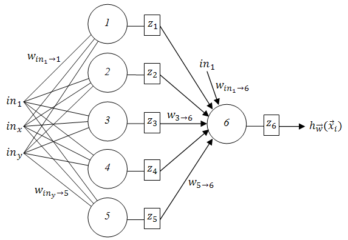
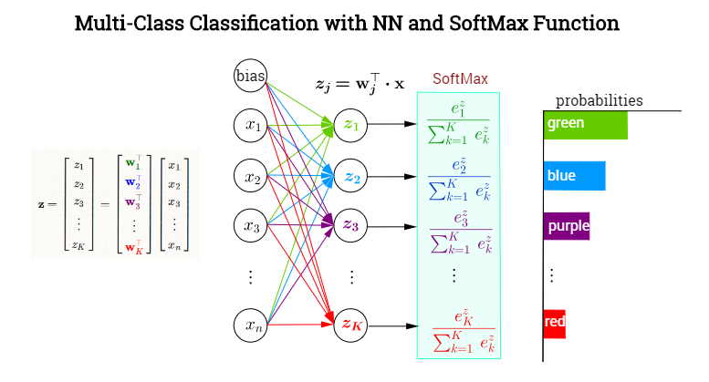

# Binary and Multiclass Classifier Networks from Scratch 

(using only numpy and having one hidden layer)

---

#### Binary Classifier Using Sigmoid Activation  

 

--- 

#### Multiclass Classifier Using (stable) Softmax Activation  

 

